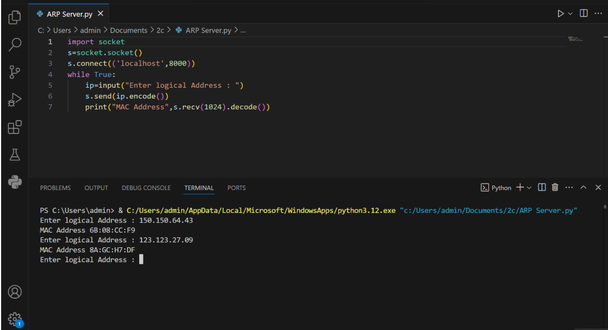
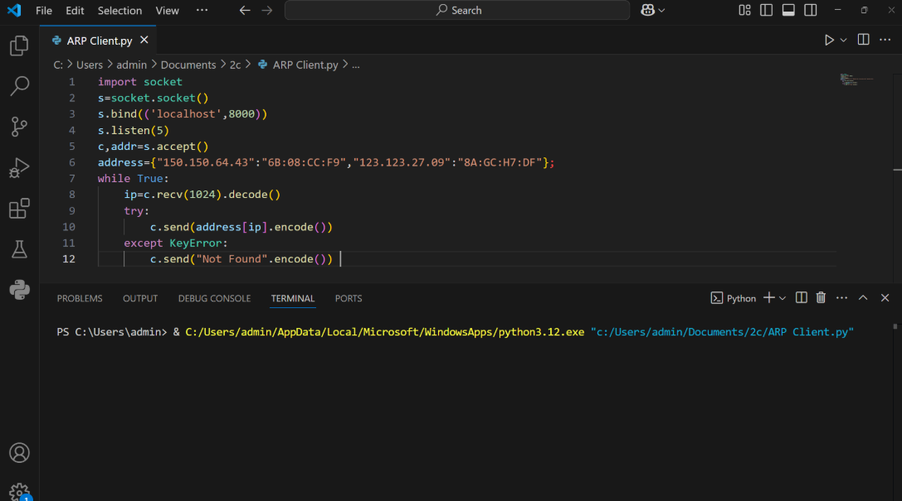
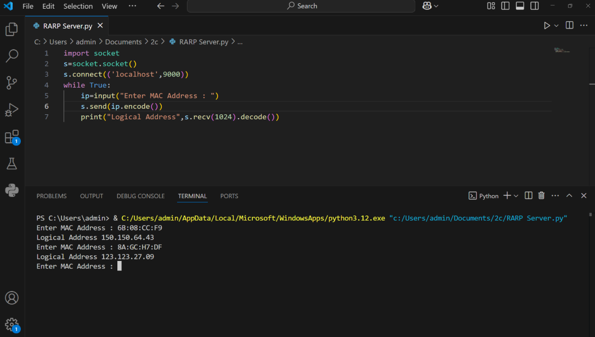
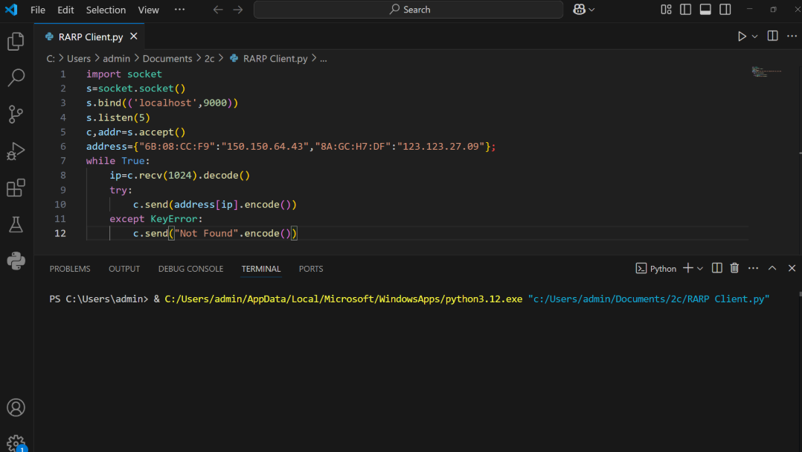

# 2c.SIMULATING ARP /RARP PROTOCOLS
## AIM
To write a python program for simulating ARP protocols using TCP.
## ALGORITHM:
## Client:
1. Start the program
2. Using socket connection is established between client and server.
3. Get the IP address to be converted into MAC address.
4. Send this IP address to server.
5. Server returns the MAC address to client.
## Server:
1. Start the program
2. Accept the socket which is created by the client.
3. Server maintains the table in which IP and corresponding MAC addresses are
stored.
4. Read the IP address which is send by the client.
5. Map the IP address with its MAC address and return the MAC address to client.
P
## PROGRAM - ARP
CLIENT
```
import socket
s=socket.socket()
s.bind(('localhost',8000))
s.listen(5)
c,addr=s.accept()
address={"150.150.64.43":"6B:08:CC:F9","123.123.27.09":"8A:GC:H7:DF"};
while True:
    ip=c.recv(1024).decode()
    try:
        c.send(address[ip].encode())
    except KeyError:
        c.send("Not Found".encode()) 
```
SERVER
```
import socket
s=socket.socket()
s.connect(('localhost',8000))
while True:
    ip=input("Enter logical Address : ")
    s.send(ip.encode())
    print("MAC Address",s.recv(1024).decode())
```

## OUPUT - ARP
SERVER


CLIENT


## PROGRAM - RARP
CLIENT
```import socket
s=socket.socket()
s.bind(('localhost',9000))
s.listen(5)
c,addr=s.accept()
address={"6B:08:CC:F9":"150.150.64.43","8A:GC:H7:DF":"123.123.27.09"};
while True:
    ip=c.recv(1024).decode()
    try:
        c.send(address[ip].encode())
    except KeyError:
        c.send("Not Found".encode())
```
SERVER
```
import socket
s=socket.socket()
s.connect(('localhost',9000))
while True:
    ip=input("Enter MAC Address : ")
    s.send(ip.encode())
    print("Logical Address",s.recv(1024).decode())
```

## OUPUT -RARP
SERVER


CLIENT


## RESULT
Thus, the python program for simulating ARP protocols using TCP was successfully 
executed.
